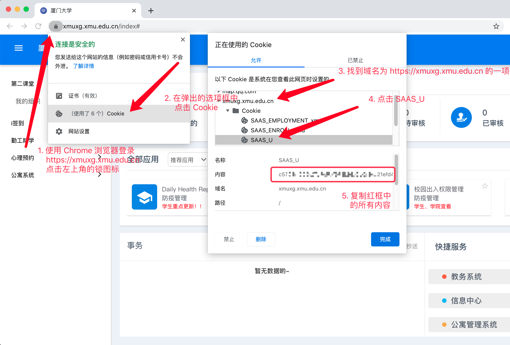

<!-- omit in toc -->
# Auto Daily Health Report

用最省力的方式完成 [厦门大学·每日健康打卡 (Daily Health Report)](https://xmuxg.xmu.edu.cn/app/214) 。

<!-- omit in toc -->
## Table of Contents

- [这是什么？](#这是什么)
- [免责声明](#免责声明)
- [开箱即用](#开箱即用)
  - [获取源代码](#获取源代码)
  - [安装依赖](#安装依赖)
  - [执行打卡](#执行打卡)
  - [搞定了~](#搞定了)
- [高级使用方法](#高级使用方法)
  - [执行打卡](#执行打卡-1)
  - [检查今日是否已打卡/获取最近打卡信息](#检查今日是否已打卡获取最近打卡信息)
- [常见问题（FAQ）](#常见问题faq)
- [打卡自动化](#打卡自动化)
  - [通过 AmiBOT / ueBOT 打卡(推荐)](#通过-amibot--uebot-打卡推荐)
  - [使用持续集成环境 (CI) 或 GitHub Actions 自动打卡 （推荐）](#使用持续集成环境-ci-或-github-actions-自动打卡-推荐)
  - [使用 Linux 计划任务 (Crontab) 自动打卡](#使用-linux-计划任务-crontab-自动打卡)
  - [通过 API 打卡（仅支持 Cookie）](#通过-api-打卡仅支持-cookie)
- [返回值](#返回值)
- [许可证](#许可证)

## 这是什么？

这是一个 Python 程序，它可以模拟登录 [厦门大学学工系统](https://xmuxg.xmu.edu.cn/)，并自动完成 [每日健康打卡](https://xmuxg.xmu.edu.cn/app/214)。截至 2020 年 8 月，这段程序已经稳定帮作者打卡了三个月。

它的原理是获取你的统一身份认证账号或 cookie 后，向学工系统服务器获取每日的健康打卡表单，然后向服务器发送打卡的 POST 请求。

## 免责声明

此项目仅供学习/交流/健忘症玩家使用；若产生任何后果（包括但不限于被学院或辅导员<s>橄榄</s>、因学工服务器接口修改等原因中断打卡等）请自负。也请对他人的健康负责，认真如实填报健康情况。

## 开箱即用

此程序基于 Python 3，需要 `requests` 和 `BeautiuflSoup, lxml` 库支持以发送网络请求、解析网页。

使用此程序要求你具有一些基础的运维技能，如使用基础的终端命令。同时确保你的电脑已经安装了 [Python 3](https://python.org/downloads).

### 获取源代码

第一步，首先使用 `git clone` 或从右上角的 `Download Zip` 获取程序源代码。

如果你的电脑已经安装了 Git，可以使用下面的命令拉取源代码：
```bash
git clone https://github.com/kirainmoe/auto-daily-health-report
```

### 安装依赖

使用终端 / 命令提示符 / Powershell 切换到项目目录下：

```bash
cd auto-daily-health-report
```

使用 `pip` 安装依赖：

```bash
pip install -r requirements.txt -i https://pypi.douban.com/simple
```

### 执行打卡

运行 `checkin.py` ，同时输入厦门大学统一身份认证账号和密码，执行打卡：

```shell
python checkin.py [username] [password]
```

其中 `[username]` 和 `[password]` 分别指代你的学工号和统一认证密码。举个例子，如果你的学工号是 `1145141919810`，密码是 `123456`，则执行以下命令进行打卡：

```shell
python checkin.py 1145141919810 123456
```

> Tips: 如果是 macOS 用户，默认 `python` 指向的是系统自带的 Python 2.8 版本，请将上面的 `python` 替换为 `python3`。

### 搞定了~

快去[学工系统健康打卡](https://xmuxg.xmu.edu.cn/app/214)看看打卡成功了没有吧。如果你在表单的修改日志里看到了修改记录，那就说明程序打卡成功了。

## 高级使用方法

### 执行打卡

由于健康打卡需要首先通过【厦门大学统一身份认证系统】进行 SSO 认证，因此需要向程序提供身份认证信息。目前程序支持以下两种方式认证：

- 通过厦门大学学工号 & 厦门大学统一认证密码模拟登录认证
- 使用已登录过 https://xmuxg.xmu.edu.cn 的名为 `SAAS_U` 的 Cookie 认证

使用用户名和密码打卡较方便，使用 Cookie 打卡更安全，但是当主动登出账号，或学工系统服务器重启时可能会过期。由于学工系统日常抽风，因此 Cookie 可能很快就会失效，建议使用用户名和密码打卡。


```bash
# 使用统一身份认证学工号/密码打卡
# 其中 [username] 为你的学工号，[password] 为你的统一认证密码
python checkin.py [username] [password]

# 使用 Cookie 打卡
python checkin.py [cookie:SAAS_U]
```

<details>
<summary>获取 SAAS_U 的示意图</summary>

</details>


### 检查今日是否已打卡/获取最近打卡信息

```bash
python recent.py [username] [password]

# or
python recent.py [cookie:SAAS_U]
```

返回 `JSON` 类型数据。若返回数据中 `today` 为 `true` 表示今日已打卡；同时返回当前账号的姓名、连续打卡天数、健康码颜色。

## 常见问题（FAQ）

**Q: 把学工号和统一认证密码直接喂给这个程序，安全吗？**
   
A: 这个程序不会储存你输入的任何用户名、密码或 Cookie, 也不会将获得和输入的用户名、密码、Cookie 等信息发送到除 `*.xmu.edu.cn` 之外的其它网站。因此在没有人窥屏你的电脑的情况下，你可以认为它是安全的。

**Q: 我还是要每天运行一遍 checin.py 打卡吗？有没有什么每天无人值守自动打卡的方法？**

A: 本项目是 `project-ami` 的自动打卡功能的核心开源实现，每天自动打卡的功能仅为 AmiBOT 和 ueBOT 开放，本程序只提供了快速填写打卡表单的操作封装，程序并不直接提供每天定时自动打卡的功能。如果你需要自动打卡，请看下面的 [打卡自动化](#打卡自动化) 部分。  
说白了，你只要想办法每天让 `checkin.py` 执行一次就可以，至于怎么做，就看你有多强了。

**Q: 安装依赖的时候出错怎么办？**

A: 在部分 Windows 10 的系统上，可能会发生 `lxml` 无法安装的情况，请到 [Python Extension Packages for Windows](https://www.lfd.uci.edu/~gohlke/pythonlibs/#lxml) 下载 `lxml‑4.5.2‑cp39‑cp39‑win_amd64.whl` 的二进制包，然后使用以下命令手动安装：

```bash
pip install lxml‑4.5.2‑cp39‑cp39‑win_amd64.whl
```

**Q: 程序报错了怎么办？**

A:当程序报错的时候有 90% 的可能是学工系统挂了，如果是这样的话只能稍后再试；剩下 10% 的可能是学工服务器接口修改，或程序出现了 BUG，请提供错误信息提 issue 告诉我。

**Q: 用了这个程序但是没打上卡/中断连续打卡了怎么办？**

A: 请向上看免责声明 :)

**Q: 看了教程我还是不会用啊？你能帮帮我吗？**

A: 那还是麻烦您每天自己打卡好了（无慈悲）。

## 打卡自动化

### 通过 AmiBOT / ueBOT 打卡(推荐)

> 提示：通过 AmiBOT / ueBOT 打卡是官方的自动化打卡渠道，作者仅对托管于 AmiBOT / ueBOT 打卡的用户负责。

你可以通过 QQ 机器人 Amiᴮᴼᵀ 和 ゆいᴮᴼᵀ 进行每日自动打卡。目前 Ami / ゆい 仅对邀请用户和以下群聊开放：

- BanGDream!@XMU
- PCR@XMU

> 提示：以上群聊并不接受以“需要代打卡”为理由的入群申请。

私聊 QQ 机器人 Ami：`ami绑定打卡`，或私聊机器人 UE： `ue绑定打卡`，Ami / ゆい 会告诉你绑定账号的具体操作方式。

<p align=center></p>

每天 7:05 开始， Ami / ゆい 会自动帮助所有绑定的人打卡，并私聊告知结果；你也可以自行使用命令查询打卡状态：


<p align=center></p>

---

### 使用持续集成环境 (CI) 或 GitHub Actions 自动打卡 （推荐）

以使用 Travis CI 为例，首先前往 travis-ci.org 注册一个账号，并在 GitHub 创建一个名称任意的项目仓库，如 `ci-health-report`.

然后在 `ci-health-report` 项目仓库中，创建 `.travis.yml` 文件，写入如下内容：

```yaml
sudo: required
os: linux
language: python
python:
- 3.8
install:
- git clone https://github.com/kirainmoe/auto-daily-health-report healthreport
- cd healthreport
- pip install -r requirements.txt
script:
- python checkin.py ${xmu_username} ${xmu_password}
```

转到 travis-ci.org ，使用 GitHub 账号登陆，然后启用 `ci-health-report` 项目的持续集成开关，并在项目设置中设置以下环境变量：

| NAME | VALUE |
|------|-------|
| xmu_username | 你的学工号 |
| xmu_password | 你的统一认证密码 |

以上环境变量在任何地方对公众都是不可见的。完成后同时在项目设置中添加 Cron Jobs，分支填写 `master`，运行时刻选 `daily` 和 `Do not run... 24h`。


然后**在打卡时间内手动触发一次集成构建**即可。

---

### 使用 Linux 计划任务 (Crontab) 自动打卡

参考源码根目录下的 `auto-report.cron`，编写 Crontab 规则，如：

```
30 7/24 * * * /usr/bin/python /path/to/checkin.py [username] [password]
```

其中，`30 7/24 * * *` 表示定时任务的运行时间规则为每日的 7:30 执行程序打卡；`/path/to/checkin.py` 表示 `checkin.py` 的完整路径，`[username] [password]` 则表示你的身份认证信息。

在 Linux 下使用以下命令激活定时任务：

```bash
crontab auto-report.cron
```

---

### 通过 API 打卡（仅支持 Cookie）

通过上文的方法获取名为 `SAAS_U` 的 Cookie，向以下地址发送 GET 请求即可自动打卡：

```
https://ami.kirainmoe.com:2333/XMUHealth/checkInByCookie?cookie=[cookie]
``` 

将 `[cookie]` 替换成你获得 Cookie 即可，该地址不会保存你的 Cookie 信息。

**你可以使用网站监控服务（监控宝、360 网站监控等）在每日 07:00-19:00 自动向地址发送 GET 请求来实现打卡。**

## 返回值

<!-- omit in toc -->
### checkin.py

签到成功与否都在 `stdout` 输出一串 JSON，包含字段 `status` （值为 `success` 或 `failed`）表示是否成功打卡。

若为 `failed`，则在 `reason` 字段说明原因（登录失败、鉴权信息错误、学工服务器内部错误等）。程序返回值为 `1`.

若为 `success`，则在 `name` 字段描述打卡对象姓名，程序返回值为 `0`.

<!-- omit in toc -->
### recent.py

获取信息成功与否都在 `stdout` 输出一串 JSON，包含字段 `status` （值为 `success` 或 `failed`） 表示是否成功获取信息。

若为 `failed`，则在 `reason` 字段说明无法获取信息的原因；若为 `success`，则有 `owner` 字段显示打卡对象姓名，`today` 字段表示今日是否打卡，`recent` 字段表示最近的打卡数据。

## 许可证

`auto-daily-health-report` is a part of `project-ami`, and it is MIT Licensed.
